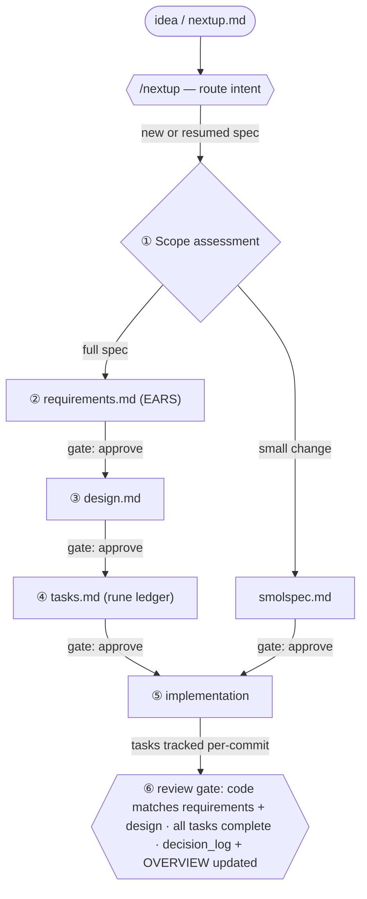
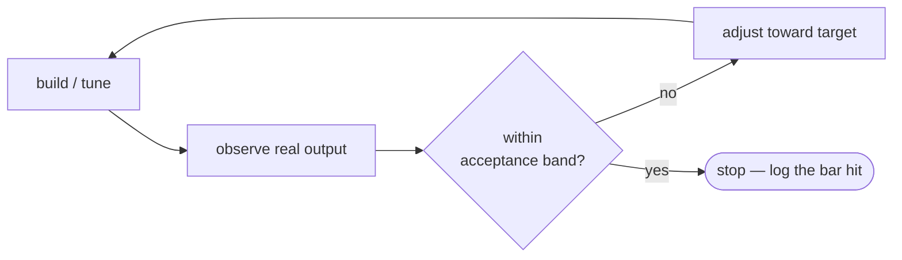

# Spec-Driven Development Process

**Audience:** anyone — human or agent — adding or changing a feature in a repository created
from this template.

**Status:** the governing description of how specs are written, tracked, and turned into code.
It is **stack-agnostic**: it prescribes the *process*, not a language, framework, or product.
A derived repo keeps this file as-is and fills in only the project-specific blanks called out
below (its domain set, §3; its stack, in `CLAUDE.md`).

This file is the **process** source of truth. The **product** source of truth is the specs
themselves — [`OVERVIEW.md`](OVERVIEW.md) indexes them. Cross-cutting decisions are distilled
in [`DECISIONS.md`](DECISIONS.md); per-spec `decision_log.md` files remain authoritative for detail.

> **Worked example.** Illustrations in this file refer to a village-hall events + booking app
> (`ui/events-and-booking/`). That example is not shipped in this repo — it is kept only as a
> teaching reference; this project's specs live under the domains in [`DECISIONS.md`](DECISIONS.md).

---

## 1. Core principle: the spec is the source of truth

Every non-trivial change is described before it is built, and the description outlives the
change. Code implements a spec; it does not replace it. When code and spec disagree, that is a
defect in one of them to be reconciled, not a state to leave standing.

This buys three things that matter as a project grows past one person and one session:

- **Onboarding.** A new developer or agent reads the spec folder, not the diff history, to
  understand *what* a subsystem does and *why*.
- **Continuity.** Work survives a context reset: the spec, not chat memory, carries intent.
- **Auditability.** The decision logs record why each load-bearing choice was made, so a
  reviewer can check the work and reasoning instead of reverse-engineering it from code.

## 2. Separation of concerns: one spec, distinct artifacts

A feature is described by **separate, scoped artifacts**, each answering one question. Keeping
them separate is what lets different *concerns* — and later different *people* — own different
parts of the same feature without colliding.

| Artifact | Answers | Concern / future owner | Driven by |
|---|---|---|---|
| `requirements.md` | **What** must be true, and for whom | Product / domain | `/starwave:requirements` |
| `design.md` | **How** it is built — architecture, data models, algorithms | Engineering | `/starwave:design` |
| `tasks.md` | **Execution** — the ordered, trackable checklist (optional in iterative mode, §5) | Implementer (dev or agent) | `/starwave:tasks`, `rune` |
| `decision_log.md` | **Why** each load-bearing choice was made | Whoever made the call | maintained as decisions land |
| `prerequisites.md` | Preconditions/inputs a large spec assumes | Engineering | created for large specs |

Today **one developer usually wears all the hats** and the agents assist within each. The
separation is not bureaucracy — it is the seam along which a team later splits: when others join,
they own `requirements.md` or `design.md` respectively, and the boundary already exists. Build
for that seam now; do not collapse the documents into one just because only one person is in the
loop currently.

## 3. Directory structure, spec boundaries, and naming

A spec is a **folder under `specs/<domain>/<capability>/`**. The path encodes two things: a
*domain* (the layer of concern, from a fixed per-project list) and a *capability* (the one
coherent thing this spec delivers). Both are kebab-case.

```
specs/
├── PROCESS.md             # this file — how specs are developed (keep as-is)
├── OVERVIEW.md            # generated index — regenerate, don't hand-merge (§9)
├── DECISIONS.md           # meta decision log — cross-cutting decisions distilled
├── <domain>/              # one of this project's fixed domains (Decision 1, §3)
│   └── <capability>/      # one coherent capability = one spec
│       ├── requirements.md   # the WHAT (EARS acceptance criteria)
│       ├── design.md         # the HOW (architecture, data models, algorithms)
│       ├── tasks.md          # the EXECUTION ledger (rune-managed; optional, §5)
│       ├── decision_log.md   # the WHY (Enhanced Nygard ADR entries)
│       └── prerequisites.md  # optional — preconditions for large specs
└── bugfixes/
    └── <bug-name>/           # fix-bug reports keep their own decision_log.md
```

### Domains — define your set first

Every spec belongs to exactly one domain. The domain set is **closed and project-specific** —
adding a domain is itself a logged decision (see [`DECISIONS.md`](DECISIONS.md) Decision 1), not
an ad-hoc choice. **A new project's first task is to confirm or edit its domain set.**

This template ships a generic **starter set**; keep what fits, rename or prune the rest, and
record the result as Decision 1:

| Domain | Owns | Prune when… |
|---|---|---|
| `platform` | app/runtime shell, build, packaging, deployment targets, runtime bindings | rarely — almost every project has one |
| `data` | persistence, schemas, data models, migrations, data ingestion | the project stores nothing |
| `api` | programmatic interfaces and external integrations (HTTP, queues, third-party I/O) | the project has no inbound/outbound interfaces |
| `ui` | user-facing surfaces, navigation, interaction, visual design (web, mobile, CLI) | the project has no human-facing surface |
| `ops` | infrastructure, CI/CD, observability, runbooks | infra is trivial and lives in `platform` |

The set is deliberately small. Resist inventing a domain per feature — domains are *layers of
concern*, not features. If a capability doesn't obviously fit, it usually belongs to whichever
existing domain owns most of its acceptance criteria (see below), not a new domain.

### Boundary: is it a new spec, or an extension?

- **Extension** — it refines or grows an *existing* capability and shares its acceptance bar.
  Add a requirement section to that spec; do not spawn a folder.
- **New spec** — it delivers a *new* user- or system-visible capability with its own acceptance
  bar. One capability per folder; a capability that needs two unrelated acceptance bars is two
  specs.
- **Cross-domain capability** — give it ONE home: the domain whose acceptance criteria dominate.
  It *references* the other domains' specs rather than duplicating them.

### Naming a spec

1. **Pick the domain** — the one layer that owns the primary outcome (where most of the
   acceptance criteria live).
2. **Name the capability** as a concrete noun phrase for *what it delivers*.

Do **not** name a spec after:
- the **layer** (`screen`, `tab`, `ui`, `view`, `service`) — the domain already says that;
- the **effort or phase** (`mvp`, `v2`, `cleanup`, `refinement`, `real-device-correctness`) —
  name the durable capability, not the project that produced it;
- the generic word **`feature`** — everything is a feature; it carries no information.

**Worked example.** The shipped example is *"a village-hall site where the public see events and
request a room, and the committee manage events."* Its acceptance criteria are dominantly about a
user-facing surface (listing, sign-in, booking form, mobile readability), so the domain is
**`ui`** — even though it writes to `data` and sends email (`api`), which it *references*. The
capability is *events and booking* → **`specs/ui/events-and-booking/`**. Not `mvp` (effort/phase),
not `feature` (vacuous), not `ui` (that's the layer, i.e. the domain).

> **The first spec is still a real spec.** A project's MVP is one capability under its dominant
> domain — not a folder literally named `mvp`. The example demonstrates this: it is the MVP, but
> it is named for what it delivers.

**Small changes use one file, not five.** A change under ~80 LOC touching 1–3 files with clear
requirements is a **smolspec**: a single `smolspec.md` (Overview / Requirements / Implementation
Approach / Risks) plus a `tasks.md` and `decision_log.md`. Do not manufacture a full five-document
spec for a simple, easily implemented change.

## 4. The development loop

The loop is sequential with an **explicit approval gate** between phases. The front door is
**`/nextup`**: it reads `nextup.md` at the repo root and routes the stated intent — resume an
existing spec at its current phase, hand a small job to a focused skill, or start a *new* spec.
`/nextup` is a router, not an executor; it classifies and hands off, never doing the work itself.
New-spec work is orchestrated by `/starwave:creating-spec`, and each phase has a skill that drives
it. Routing a new capability through that chain is what fixes its domain and capability name up
front (§3) — a spec never gets a file before it has a convention-correct home.



1. **Scope assessment** — research the affected code, estimate size, choose smolspec vs full
   spec. When uncertain, default to the full spec.
2. **Requirements** — the *what*, in EARS (§6). No solutions here.
3. **Design** — the *how*: architecture, data models, the approach. Where the design rests on an
   external fact, contract, or non-obvious calculation, cite it. No code yet.
4. **Tasks** — decompose design into an ordered checklist mapped back to requirements, created
   with `rune` (§7).
5. **Implementation** — execute the `rune` ledger in order with `/make-it-so` (works a whole
   phase, delegating tasks to subagents) or `/next-task` (one task group at a time); update the
   ledger per commit (§7).
6. **Review** — the SSOT gate (§8).

This linear path is the **full-spec** loop. Smolspecs collapse phases 2–4 into one document;
**iterative** work (§5) replaces the task ledger with a target-and-converge loop. The *gates*
still apply in every mode.

**The gates are the process.** Do not start design before requirements are agreed, or code before
its plan exists — a `tasks.md` ledger in full/smol mode, or an agreed target and acceptance band
in iterative mode (§5). For a solo developer the "approval" is a deliberate self-review (the
`/explain-like` skill helps — explaining the design at three levels surfaces gaps), with `/sendit`
shipping the spec documents to an external review folder when a human sign-off is wanted. The gate
is real even when the approver and author are the same person.

## 5. Choosing the mode: full spec, smolspec, or iterative

Three modes. Pick by the *nature* of the work, not size alone.

**Full spec** — a feature with a definable correct answer. The default; required for anything
touching the data model, a public contract, or a safety/security path, regardless of line count.

**Smolspec** — small, isolated change. Use only when *all* hold: <80 LOC, 1–3 files, single
component, clear requirements, no breaking changes, no cross-cutting concerns (security,
performance, privacy). If *any* fails, use the full spec.

**Iterative (taste/target-driven)** — work that converges on a *target* by judgement rather than
against a fixed pass/fail list: UI look-and-feel, motion, copy tone; or tuning toward a measurable
target (latency, accuracy) where you adjust until the result meets the bar. Here "complete" is
replaced by *"near enough is good enough against the target"*. A `tasks.md` ledger often adds
nothing — there is no fixed, orderable checklist, only a loop you stop when the result meets the bar.

### The iterative loop

`requirements.md` still defines the **targets and acceptance bands** — what "good enough" means,
measurably where it can be. `design.md` records the approach and points at the reference. Then iterate:



- **The target is an artifact, not a memory.** Iterating against a *written* target (a design
  reference, a measured threshold) is what keeps "taste" reviewable.
- **Observe with real output** — screenshots / real runs (the `/verify` and `/run` skills), never
  assumptions.
- **Get an independent read** — the `/ui-ux-reviewer` skill, or a second-opinion critique from an
  `mcp-devtools` agent (`gemini-agent` / `codex-agent`), catches taste drift a single author misses.
- **Stop at the bar.** When the output is inside the band, stop — do not gold-plate. Record the bar
  reached and any conscious "near enough" trade-offs in `decision_log.md`.

**`tasks.md` is optional in this mode.** When the work is a convergence loop rather than an orderable
checklist, omit it — the targets in `requirements.md` plus the decision log carry the state. Add a
`tasks.md` only when discrete, separable steps actually emerge.

## 6. Requirements in EARS

Acceptance criteria use EARS (Easy Approach to Requirements Syntax) with `SHALL`, **each**
criterion individually anchored so design and tasks can reference it:

```markdown
### 1. Public Events Listing
**User Story:** As a member of the public, I want to see what's coming up at the hall, so that
I know what's on and when.

**Acceptance Criteria:**
1. <a name="1.1"></a>The system SHALL display a public page listing events whose date is today
   or later, sorted by date and start time ascending.
2. <a name="1.2"></a>WHEN there are no upcoming events, the system SHALL display a plain message
   stating nothing is currently scheduled, rather than an empty page.
```

Requirements state observable system behaviour and constraints — never an implementation.
"WHEN \<trigger\>, THE SYSTEM SHALL \<action\>" is the canonical event-driven form; plain "The
system SHALL \<action\>" covers invariants. Reference units and domain rules explicitly. See
[`ui/events-and-booking/requirements.md`](ui/events-and-booking/requirements.md) for a full example.

## 7. Stateful task ledgering and execution

Tasks are a **programmatic, version-controlled ledger**, not prose and not throwaway chat-driven
TODOs. `tasks.md` is managed with the `rune` CLI so state lives in the file and moves with the repo.

```bash
rune create specs/<domain>/<capability>/tasks.md --title "<Capability>"   # scaffold
rune add    specs/<domain>/<capability>/tasks.md --title "..." --phase "Phase 1"
rune next   specs/<domain>/<capability>/tasks.md                          # next ready task
rune progress specs/<domain>/<capability>/tasks.md 1.2                    # mark in-progress
rune complete specs/<domain>/<capability>/tasks.md 1.2.1                  # mark done
rune list   specs/<domain>/<capability>/tasks.md --filter pending
```

Update the ledger as work happens — set a task in-progress when you start it and complete it in the
same commit that lands its code, so the ledger and the tree never drift. A task should name the
requirement(s) it satisfies and the file(s) it touches. Iterative work (§5) omits the ledger; its
state lives in the targets and the decision log instead.

Day-to-day, a single developer executes the ledger through `/make-it-so` / `/next-task` (§4) — no
orchestrator required. `rune`'s streams/owner model exists to run **parallel** agents across
independent tasks; reach for it only when a spec has genuinely parallel, independent task streams,
not by default. The requirement is that task *state* is tracked in `rune`, not how tasks are executed.

## 8. Keeping spec and code aligned (SSOT enforcement)

The spec stays authoritative through the **review gate**, not through tooling that guesses at
meaning. A change is done only when:

- every task in `tasks.md` is `[x]`;
- the code matches `requirements.md` (behaviour) and `design.md` (structure) — the reviewer checks
  this directly, along the same separation-of-concerns the documents were written on;
- new load-bearing choices are in `decision_log.md`, and `OVERVIEW.md` reflects the spec's status.

> **Why no pre-commit "alignment" hook.** A git hook that truly judged whether changed code still
> satisfies the requirements/design would need a language model in the commit path: slow,
> non-deterministic, and adversarial to a solo developer's commit loop. The structural checks a hook
> *could* do deterministically (folder well-formed, OVERVIEW in sync) are low value relative to that
> friction. Enforce alignment at the review gate instead. If lightweight structural linting is ever
> wanted, run it in CI as a non-blocking check — not as a commit-blocking hook.

## 9. Spec hygiene across branches

Intent must not be branch-local. **Every branch carries the `specs/` tree** (the `requirements.md`
files at minimum), so a line of work never holds the only copy of *why* it exists. A feature branch
may add its own `specs/<domain>/<capability>/` long before its code is merged — **intent lands
first, code follows**.

The per-capability folder layout (§3) is what makes parallel work safe: independent efforts touch
**disjoint folders**, so spec merges are additive and conflict-free. Only three files are shared,
and each has a rule that avoids hand-merging:

- **`OVERVIEW.md`** is a generated index — regenerate it from the folders after a merge (the
  `/specs-overview` skill), never resolve it by hand.
- **`DECISIONS.md`** is a synthesis; on conflict the per-spec `decision_log.md` wins (it already
  says so). Reconcile the meta log after the capability has landed.
- **`PROCESS.md`** changes rarely and is reviewed on its own.

## 10. Adding a domain or decomposing a large spec

**Adding a domain** is a logged decision (amend Decision 1 in `DECISIONS.md`), not an ad-hoc
`mkdir`. Do it only when a genuinely new *layer of concern* appears that no existing domain owns —
not for a feature that fits an existing domain.

**Splitting a large spec** earns its keep only when separate concerns within it acquire **separate
owners, separate platforms, or separate change-cadences**. Splitting earlier is premature: it
scatters cross-references for no current benefit and makes the spec *harder* to keep coherent.
Splitting once a forcing function exists pays for the churn. When the time comes: keep the root spec
as the canonical overview (shared assumptions, the cross-cutting decision log) and extract
self-contained concerns into child specs that link back up; rewrite cross-references in the same pass;
carry each extracted decision's history with it.

## 11. Quick checklist

Before opening a change for review:

- [ ] Domain set defined / current (§3, Decision 1); spec lives at `specs/<domain>/<capability>/`
  named for the capability — not the layer, effort, or "feature".
- [ ] Boundary checked (new spec vs extension, §3).
- [ ] Right mode chosen (full / smol / iterative, §5).
- [ ] `requirements.md` in EARS, criteria anchored; no implementation leaked in — or, in iterative
  mode, the target and acceptance band are stated and measurable where possible.
- [ ] `design.md` records the approach and cites sources where it rests on external facts; no
  requirements restated.
- [ ] `tasks.md` exists in `rune`, tasks map to requirements, state is current — *unless* iterative
  mode, where the converge-on-target loop and decision log carry the state.
- [ ] Code matches requirements + design; units/safety/security paths honoured.
- [ ] `decision_log.md` has any load-bearing decisions (Enhanced Nygard ADR format).
- [ ] `OVERVIEW.md` updated (status + links); `DECISIONS.md` updated if cross-cutting.
</content>
</invoke>
