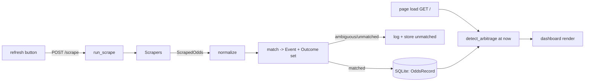

# Design: Cross-Book Arbitrage (Australian Betting Odds Scraper)

## Overview

A greenfield, single-user, local tool that scrapes odds from three Australian bookmakers, lines
up the same event/outcome across them, and reports guaranteed cross-book arbitrage with stake
instructions. SQLite-backed, surfaced through one Flask-served dashboard page — the only interface
(Decision 5).

## Stack

The requirements are language-agnostic (Decision 3); the design commits the stack (Decision 12).

| Concern | Choice | Note |
|---|---|---|
| Language | Python 3.11+ | Matches the operator's Python familiarity and the project tooling |
| Datastore | SQLite via SQLAlchemy ORM | Single local file; no server (Decision 2) |
| Web | Flask + Jinja2 | Serves one page; no standalone REST API (Non-Goals, Decision 5) |
| Config | `pydantic-settings` | File + env, documented defaults (Req 2) |
| HTTP | `requests` (sync) | No browser runtime on the default path (Req 3.6, Decision 14) |
| Money math | odds as `Decimal` (parsed from source text, never float), `Decimal` margins, integer-cent stakes | No float anywhere on the odds→arbitrage path (Req 7.7) |
| Test | `pytest` + `hypothesis` (dev only) | Arbitrage math only (Req 7.7, Decision 8) |

## Architecture

### Package layout

Installable `betscraper/` package (Decision 13). Built from scratch — there is no prior code to
uplift (Decision 2).

```
betscraper/
  __main__.py        start the dashboard; init_db() on first run (Req 1.3, 1.5)
  config.py          Settings (pydantic-settings) + BOOKMAKERS / SPORTS / MARKETS reference tables
  logging_setup.py   console + rotating file handler
  db.py              engine (WAL + busy-timeout), session factory, init_db (schema + seed bookmakers, markets)
  models.py          SQLAlchemy models — the six in Req 5.5
  scrape/
    base.py          BaseScraper, HTTP fetch helper, ScrapedOdds, to_decimal, registry
    sportsbet.py     working
    tab.py           working
    ladbrokes.py     working
    stubs.py         bet365, neds, unibet (not-implemented markers)
  pipeline/
    normalize.py     text/market/outcome canonicalisation + alias tables
    matching.py      canonical event key, resolve_event, required-outcome set
    persistence.py   ScrapedOdds -> Event/Outcome/OddsRecord rows, ScrapingRun logging
    runner.py        run_scrape(sports): orchestrates books x sports, returns per-book summary
  arbitrage.py       pure margin + stake-split + detection over stored odds
  web/
    app.py           Flask app factory; routes GET / and POST /scrape; one-at-a-time scrape lock
    templates/index.html
    static/style.css
tests/test_arbitrage.py
docs/                quickstart, usage, adding-a-scraper, arbitrage-explained, limitations
pyproject.toml
```

### Data flow

Scrapers stay thin: fetch and return `ScrapedOdds` (decimal odds already converted, raw labels
preserved). All canonicalisation, matching, and persistence live in the pipeline, so adding a
bookmaker is one fetch+parse method — no change to matching or arbitrage logic (Req 2.4, 3).



`detect_arbitrage()` runs at each page load (Req 8.5), reading stored odds. The scrape path is
distinct from the view path: a browser reload re-runs detection but **never** scrapes (Req 8.6).

### Interface scope (Decision 5)

The dashboard is the only interface. There is no Typer CLI of subcommands and no standalone REST
API. `python -m betscraper` is a single start command (Req 1.5) that creates the SQLite file and
seeds it on first run (Req 1.3), binds the configured host/port, and serves the page. The two
Flask routes are the dashboard's own backend, not a published API:

| Route | Purpose | Requirements |
|---|---|---|
| `GET /?sport=&stake=` | Render odds table + arbitrage opportunities, recomputed now | 8.1, 8.2, 8.3, 8.4, 8.5, 8.9 |
| `POST /scrape` | Trigger one scrape of configured sports, then render with per-book summary | 8.6, 8.7, 8.8 |

## Components and Interfaces

### Scraper contract (`scrape/base.py`)

```python
@dataclass
class ScrapedOdds:
    bookmaker_code: str
    sport_code: str
    raw_event_name: str          # verbatim, surfaced to user (Req 7.8)
    participants: list[str]      # as displayed by the book
    start_time: datetime | None  # UTC — scrapers convert from the book's local zone via
                                 #   zoneinfo (e.g. Australia/Sydney), not a fixed offset, so DST is correct
    raw_market: str
    raw_selection: str
    decimal_odds: Decimal        # parsed from source text, never via float
    scraped_at: datetime         # UTC

class BaseScraper(ABC):
    code: str
    def fetch(self, sport_code: str) -> list[ScrapedOdds]: ...
    # provided: get(url) -> response with timeout, retry+backoff, per-request delay (Req 3.2)
    # provided: to_decimal(raw) -> Decimal | None  (parse source text directly, never via float;
    #           skip + warn on failure, Req 3.4)
```

- A registry maps `code -> scraper class`. A configured book with no registered scraper is logged
  and skipped, not silently dropped (Req 3.5); stubs raise a clear "not implemented" and are
  reported the same way (Req 4.4).
- `fetch` returns `[]` and logs when a book does not offer a sport (Req 4.3). A fetch failure after
  retries logs book/sport/URL and the run continues (Req 3.3, 9.4).
- The three shipping scrapers use plain HTTP/JSON, preferring each site's JSON endpoint over HTML
  (Decision 14); **no Selenium path is built**. Req 3.6's headless-browser exception is documented
  in `docs/adding-a-scraper`, not carried as code — building it before a scraper needs it is
  unjustified complexity.

### Scrape orchestration (`pipeline/runner.py`)

```python
def run_scrape(session, sports: list[str]) -> dict[str, RunSummary]
```

For each enabled bookmaker x enabled sport: fetch → normalize → match → persist, recording one
`ScrapingRun` per (book, sport) with status and record count (Req 5.3, 9.2). A failure in any
single book/sport/record is caught, logged with context, and the run continues — one failure never
aborts the whole scrape (Req 3.3, 9.3, 9.4). Returns a per-book summary (records collected,
errors) for the dashboard to surface (Req 8.6, 8.8).

### Pipeline

```python
# normalize.py
def norm_name(s: str) -> str            # lower, strip punctuation, collapse ws, apply alias map
def canon_market(raw: str) -> str|None  # "match winner"/"h2h" -> "h2h"; "1x2" -> "1x2"; ...
def canon_outcome(raw_sel: str, participants: list[str]) -> str|None  # -> a participant or "draw"

# matching.py
def event_key(sport, participants) -> str               # sport | sorted(norm participants)
def resolve_event(session, key, start_time, match_window) -> Event | AMBIGUOUS | None
def required_outcomes(event, market_code) -> list[str]   # the complete slot set for the market
```

Matching is deterministic (Decision 15). The canonical key is `sport | sorted(normalized
participants)` — **no date in the key**; sorting cancels home/away order differences. All temporal
logic lives in `resolve_event`: it finds candidate events sharing that participant key whose
`start_time` is within the configured **match window** (Req 6.3 — a few hours, distinct from and
unrelated to the freshness window of Req 7.6) of the incoming record. Keeping the date out of the
key avoids the UTC-midnight boundary that would split an event listed at 23:58 by one book and
00:03 by another; the match window still separates two fixtures between the same participants on
different days. Sorting plus an alias table is the whole matching strategy — no fuzzy/probabilistic
matching (Req 6.3). If the incoming record matches more than one candidate event inside the window,
the records are **not** merged: they are stored unmatched and logged (Req 6.3, 6.4). A record whose
`start_time` is `None` cannot be windowed, so it is stored unmatched with a reason rather than
guessed.

`Event` and `Outcome` are **get-or-create** so repeated scrapes do not duplicate them: on a `None`
result `resolve_event` creates one `Event` (the next scrape of the same fixture resolves to it via
the window, not a second row, even though `canonical_key` is non-unique); `Outcome` rows are
get-or-created per `(event_id, market_code, label)`. Only `OddsRecord` is appended each scrape, so
the `max(scraped_at)` latest-odds selection is never fragmented across duplicate parents.

`required_outcomes` returns the **expected** mutually-exclusive set for an `(event, market)` from
the market kind over the event participants — h2h = the two participants; 1x2 = `{participant_a,
draw, participant_b}`; matchup (golf) = the agreed player set (Req 6.5). For matchups the **tie
treatment** (tie-no-bet, i.e. stake returned on a dead heat, versus an explicit tie price) is part
of the canonical market identity: books whose tie treatment differs are not combined — the event is
an incomplete-set skip, never a merged market with mismatched semantics (a phantom-arb guard).
These materialise as `Outcome` rows. A scraped selection `canon_outcome` cannot map to one of those
slots is stored unmatched with a reason and logged; because detection requires a price for every
required slot (Req 7.4), an event with an unmappable leg becomes an incomplete-set skip, never a
smaller false outcome set.

### Arbitrage engine (`arbitrage.py`)

Pure functions over a prepared structure (no DB access → unit-testable, Req 7.7). Margin uses
`Decimal`; stakes are computed in **integer cents** so float drift cannot misclassify a borderline
`margin < 1` or round a leg into a loss:

```python
def margin(best_odds: list[Decimal]) -> Decimal               # sum(1/o)
def split(best_odds, total_stake_cents) -> StakeResult         # per-outcome cents, floored
def detect_arbitrage(session, total_stake, now) -> tuple[list[Opportunity], Diagnostics]
```

**Expected outcome set, not observed.** `detect_arbitrage` requires a fresh best price — the
**highest** decimal odds across all bookmakers for that outcome (Req 7.1) — for every **required**
outcome (from `required_outcomes`), never merely the subset that happened to be scraped. A missing soccer draw is an incomplete-set skip, not a 2-way market (Req 7.4). Golf
matchups are compared only where all books agree on the same player set and tie treatment;
otherwise incomplete-set skip.

**Flagging is post-rounding, not on the raw margin.** `margin < 1` makes an event a *candidate*; it
is only **reported** when, after `split` floors each stake to the cent, the worst-case guaranteed
return `min(stakeᵢ × oddsᵢ)` strictly exceeds the actual staked total `sum(stakeᵢ)` and the
resulting profit clears `min_profit_pct` (Req 7.3, 7.5). Flooring lowers every leg's return, so on
a thin margin with a high-odds leg the raw margin can be `< 1` while a floored leg returns less than
staked — that candidate is dropped. Profit is `min(stakeᵢ × oddsᵢ) − sum(stakeᵢ)` and ROI is
`profit / sum(stakeᵢ)`, both against the **actual** staked total (not the requested stake), since
flooring leaves a few cents unallocated — the worked example stakes $99.97 of $100. Each reported
opportunity carries profit %, ROI, and per outcome: bookmaker, decimal odds, stake, scrape time, and
raw source event name (Req 7.3, 7.8).

`detect_arbitrage` selects the most recent odds per book/outcome (`max(scraped_at)`, tie-broken by
highest `id`) and keeps only legs scraped within the freshness window (Req 7.6). Evaluation order
is fixed so diagnostic counts are mutually exclusive: **incomplete-set → stale → margin →
below-threshold**. `Diagnostics` reports records scraped, bookmakers covered, matched events,
incomplete-set skips, stale-excluded events, and below-threshold count, so the empty state is
interpretable (Req 8.9, 10.6).

Worked example (3-way, total stake $100 = 10000c): best odds `2.1 / 3.6 / 4.0` → `margin = 1.004`
→ **no arb**. With `2.2 / 3.8 / 4.5` → `margin = 0.9399` → floored stakes `4834 / 2799 / 2364`c
(staked $99.97), each leg returning ≈ $106.3 → ≈ 6.4% profit, clears the gate. The exact figures
come from `split`; `test_arbitrage.py` is their authority.

### Dashboard (`web/app.py`)

One Jinja2 page (Req 8.1) with: an arbitrage table (per leg: book, decimal odds, stake, leg age —
Req 8.2), a current-odds table filterable by sport via `?sport=` (Req 8.4), and a total-stake input
that feeds `?stake=`; when empty or invalid the configured `default_stake` is used (Req 8.3). Both
tables read through `detect_arbitrage(now)` / an odds query, recomputed on every load so a page left
open never shows legs that have since gone stale (Req 8.5).

**Refresh is a distinct action from a reload (Decision 18).** The refresh button issues `POST
/scrape`; a browser reload issues `GET /` and only recomputes from stored odds — it never scrapes
(Req 8.6). The POST runs the scrape **synchronously** then returns the freshly rendered page with a
per-bookmaker summary. One-at-a-time (Req 8.7) is enforced by a module-level non-blocking lock: if a
scrape is already running, the POST is rejected (`409`, "scrape already running") rather than
starting a second; the in-progress state is conveyed by the browser's own loading state during the
blocking request. The server runs multithreaded (`threaded=True`) so the lock can actually reject a
concurrent POST and a `GET /` stays responsive while a scrape holds one worker; SQLite runs in WAL
mode with a busy-timeout so the view-time read never collides with the scrape write. The scrape is
sequential (politeness delays, retries, backoff), so a full refresh can take minutes — acceptable
for a manual single-user action, bounded only by the per-fetch timeout × retries. On partial or total scrape failure the per-book errors are surfaced in the summary
and the previously stored odds and opportunities stay visible — never an error or blank page (Req
8.8). Empty states (Req 8.9): never-scraped shows a prompt to refresh; scraped-but-nothing-qualifies
shows the `Diagnostics` summary.

## Data Models

SQLite, exactly the six models enumerated in Req 5.5 — `Bookmaker`, `Market`, `Event`, `Outcome`,
`OddsRecord`, `ScrapingRun` — and no others (Decision 17). Sport is **not** in that list, so it is a
config reference (a `SPORTS` table in `config.py`) carried as a `sport_code` column, not a DB model.
All timestamps UTC.

| Model | Key fields | Notes |
|---|---|---|
| `Bookmaker` | code, name, base_url | Seeded from `config.BOOKMAKERS` (single source of truth); `enabled_bookmakers` governs at runtime |
| `Market` | code, name, kind | Reference/seeded: `h2h` (2-way), `1x2` (3-way), `matchup` (N-way) — `kind` drives the required-outcome set |
| `Event` | sport_code, canonical_key (indexed, **not** unique), participants (JSON), start_time | Same participants can meet on different days |
| `Outcome` | event_id, market_code, label, position | The canonical mutually-exclusive slot (a participant or `draw`); the complete set per event+market (Req 6.5) |
| `OddsRecord` | bookmaker_code, outcome_id (**nullable**), decimal_odds, scraped_at, raw_event_name, raw_market, raw_selection, unmatched_reason (nullable) | Append-only; `decimal_odds` stored as TEXT so the `Decimal` round-trips exactly (SQLite has no native Decimal/`REAL` would reintroduce float) |
| `ScrapingRun` | bookmaker_code, sport_code, status, record_count, error_message, started_at, completed_at | One per (book, sport) per scrape |

`OddsRecord` is append-only; "latest odds" is `max(scraped_at)` per (bookmaker, outcome). This
retains history implicitly without a separate history table (Decision 16, Req 5.2, 5.4). An
unmatched record is stored with `outcome_id = NULL` and an `unmatched_reason`, retained but excluded
from detection (Req 6.4).

## Error Handling

- A single book/sport/record failure never aborts the run; each is caught, logged with context
  (book, sport, event/URL), and processing continues (Req 3.3, 9.3, 9.4).
- Fetch: timeout + `max_retries` with backoff + per-request politeness delay (Req 3.2).
- Odds parse failure: skip the selection, warn (Req 3.4). Missing/invalid config: log the setting,
  use the documented default (Req 2.3).
- Logging to console + a rotating file at a configurable level, with each run logging start/end and
  per-book counts (Req 9.1, 9.2).

## Testing Strategy

Per the non-goal, no broad suite — error logging is the reliability mechanism — **except** the
arbitrage math, which is unit-tested (Req 7.7, Decision 8).

- **Example-based** (`test_arbitrage.py`): `margin`/`split` for 2-, 3-, and N-way markets; the
  boundary where `sum(1/odds) == 1` (not an arb); the worked example above; and that stake rounding
  never produces a losing leg.
- **Property-based (Hypothesis)** — invariants example tests cover weakly:
  1. *Profitability of reported opportunities*: for any opportunity the detector **reports**, every
     leg's floored return strictly exceeds the actual staked total — asserted on the post-rounding
     figures. The generator must include tiny stakes and odds near 1000 to exercise the
     thin-margin/high-odds region where naive flooring would fail.
  2. *Conservation*: `sum(floored stakes) ≤ total_stake`.
  3. *Idempotence of normalization*: `norm_name(norm_name(x)) == norm_name(x)`; chained aliases
     A→B→C resolve to a fixed point, not one pass.

Matching and scrapers are validated through logs and manual runs, not automated tests; a light
smoke test may exercise matching on a fixed sample. A false match is the one non-arithmetic
money-losing mode, but per Decision 7 it is guarded *not* by tests but by the ambiguity rule (which
excludes uncertain merges) and by the operator verifying each leg's raw source event name before
staking (Req 7.8) — so concentrating automated tests on the arbitrage math (Decision 8) is
consistent, not a gap.

## Traceability

| Req group | Components |
|---|---|
| 1 Setup, 2 Config | `__main__.py`, `db.py`, `config.py`, `pyproject.toml` (pinned deps, Req 1.2) |
| 3 Framework, 4 Scrapers | `scrape/` |
| 5 Persistence | `models.py`, `pipeline/persistence.py` |
| 6 Normalisation/matching | `pipeline/normalize.py`, `pipeline/matching.py` |
| 7 Arbitrage | `arbitrage.py`, `tests/` |
| 8 Dashboard | `web/`, `pipeline/runner.py` |
| 9 Logging | `logging_setup.py` (cross-cutting) |
| 10 Docs | `docs/` |
